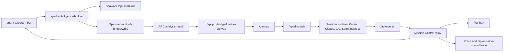

# Spawner UI Architecture

Spawner UI is the local execution plane and visual dashboard for Spark missions. It sits behind `spark-telegram-bot` and `spark-intelligence-builder`; it does not own Telegram ingress.

## Current System Shape



## Core Surfaces

| Surface | Route | Responsibility |
| --- | --- | --- |
| Landing | `/` | Spark product entry and hosted/local setup path |
| Canvas | `/canvas` | Mission-scoped graph, execution panel, provider dispatch |
| Kanban | `/kanban` | Mission board, scheduled runs, task rollups |
| Mission detail | `/missions/[id]` | Inspect one mission after completion/failure/cancel |
| Trace | `/trace` | Cross-surface mission tracer |
| Spark live setup | `/spark-live/setup`, `/spark-live/login` | Hosted Spark readiness and operator access |
| Skills | `/skills`, `/skills/find`, `/skills/[id]` | H70 skill discovery and inspection |

## Primary APIs

| API | Purpose |
| --- | --- |
| `POST /api/spark/run` | Start a direct Spark mission from a goal |
| `POST /api/prd-bridge/write` | Accept a PRD/build request and prepare analysis |
| `GET /api/prd-bridge/result` | Read a stored PRD analysis result |
| `POST /api/prd-bridge/load-to-canvas` | Queue a mission-scoped canvas load |
| `GET/POST/DELETE /api/pipeline-loader` | Consume or manage pending canvas loads |
| `POST /api/dispatch` | Dispatch a canvas execution pack to provider runtime |
| `GET /api/dispatch` | Inspect provider runtime status |
| `POST /api/events` | Receive provider, PRD, task, and mission lifecycle events |
| `GET /api/mission-control/board` | Return Kanban board buckets |
| `GET /api/mission-control/status` | Return raw mission status |
| `POST /api/mission-control/command` | Pause, resume, kill, or inspect missions |
| `GET /api/mission-control/trace` | Stitch Telegram, PRD, canvas, dispatch, provider, and board state |
| `/api/spark-agent/*` | Session-scoped Spark agent bridge for canvas, mission, MCP, and event stream control |

## State Model

Spawner is local-first. Persistent runtime state lives under `SPAWNER_STATE_DIR` when set, otherwise `.spawner/` in the working directory.

| State file | Writer | Reader |
| --- | --- | --- |
| `pending-prd.md` | `/api/prd-bridge/write` | PRD auto-analysis |
| `pending-request.json` | `/api/prd-bridge/write` | PRD loading and trace |
| `results/<requestId>.json` | `/api/events`, PRD result endpoint | Canvas loading and trace |
| `pending-load.json` | `/api/prd-bridge/load-to-canvas` | Canvas pipeline loader |
| `last-canvas-load.json` | PRD/canvas loader | Event relay enrichment and trace |
| `mission-control.json` | Mission Control relay | Board, status, trace |
| `mission-provider-results.json` | Provider runtime | Board, trace, result summaries |

## Mission Lifecycle

The canonical mission and task status contract lives in `src/lib/types/mission-control.ts`.

Mission statuses:

- `created`
- `running`
- `paused`
- `completed`
- `failed`
- `cancelled`

Task statuses:

- `queued`
- `running`
- `completed`
- `failed`
- `cancelled`

Terminal states must be monotonic. Older running events must not downgrade completed, failed, or cancelled tasks.

## Provider Runtime

Spawner can route work through:

- local Codex/Claude CLI clients when available
- ZAI/OpenAI-compatible coding providers
- Spark harness client
- configured Mission Control providers from `/api/providers`
- MCP tools discovered through the MCP runtime snapshot

The provider runtime reports task and mission lifecycle back through `/api/events`, which feeds Mission Control, Kanban, Trace, Canvas hydration, and Telegram relay summaries.

## Spark Agent Bridge

`/api/spark-agent/*` is the current session bridge for Spark-controlled canvas and mission operations:

- `POST /api/spark-agent/session/start`
- `POST /api/spark-agent/command`
- `GET /api/spark-agent/events?sessionId=...`
- `POST /api/spark-agent/session/end`
- `GET /api/spark-agent/canvas-state`

See `docs/SPARK_AGENT_BRIDGE_API.md` and `docs/SPARK_AGENT_CANVAS_LOCALHOST_RUNBOOK.md`.

## Security Boundary

Spawner UI is a local operator surface unless explicitly hosted with auth and origin policy.

- Telegram bot tokens belong to `spark-telegram-bot`, not Spawner UI.
- Mission callbacks to Telegram use `MISSION_CONTROL_WEBHOOK_URLS` and `TELEGRAM_RELAY_SECRET`.
- Spark agent bridge control APIs use `SPARK_AGENT_API_KEY` and `SPARK_AGENT_ALLOWED_ORIGINS` when exposed beyond loopback.
- Local project writes should remain inside the configured Spark workspace unless `SPARK_ALLOW_EXTERNAL_PROJECT_PATHS=1` is set for trusted development.

## Test Gates

Use these gates before claiming a mission-control or canvas change is ready:

```bash
npm run check
npm run test:run
npm run build
npm run smoke:routes
npm run smoke:mission-surfaces
```

Route smoke covers `/`, `/kanban`, `/missions/mission-smoke-route`, `/canvas`, `/trace`, `/api/mission-control/board`, `/api/mission-control/trace`, and `/api/spark-agent/canvas-state`.

Mission surface smoke creates a synthetic PRD result, loads a mission-scoped canvas, relays lifecycle events to completion, and verifies Kanban, mission detail, canvas, trace, and Spark agent bridge surfaces.
