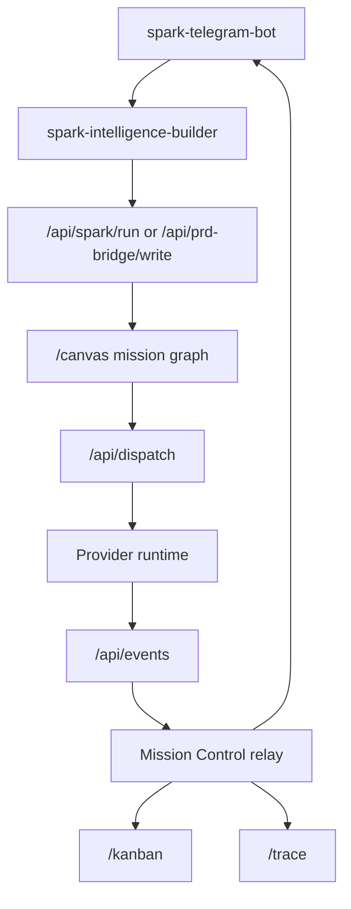

# CLAUDE.md - Spawner UI

This file is for coding agents working inside `spawner-ui`.

Spawner UI is Spark's local execution plane and visual mission dashboard. It is part of the Spark ecosystem alongside `spark-telegram-bot`, `spark-intelligence-builder`, and `domain-chip-memory`.

## Non-Negotiable Mission Rules

When executing a Spawner mission:

1. Do not pause mid-workflow for confirmation unless a safety boundary requires it.
2. Complete the requested project or clearly report the exact blocker.
3. Run verification before declaring completion.
4. Send lifecycle events through `/api/events` so Canvas, Kanban, Trace, and Telegram stay synchronized.
5. Send progress heartbeats during long work. Do not let a mission look frozen.
6. Keep terminal states monotonic. Do not downgrade completed, failed, or cancelled tasks with stale running events.

Useful event types:

- `mission_created`
- `task_started`
- `task_progress`
- `task_completed`
- `task_failed`
- `task_cancelled`
- `mission_completed`
- `mission_failed`
- `mission_cancelled`

## Current Spark Flow



## Important Routes

| Route | Use |
| --- | --- |
| `/` | Product entry and setup journey |
| `/canvas` | Visual pipeline and execution panel |
| `/kanban` | Mission board and scheduled mission management |
| `/missions/[id]` | Mission detail inspection |
| `/trace` | Cross-surface tracer |
| `/api/spark/run` | Direct mission run API |
| `/api/prd-bridge/write` | PRD/build request intake |
| `/api/prd-bridge/load-to-canvas` | Queue a mission-scoped canvas |
| `/api/dispatch` | Dispatch provider execution |
| `/api/events` | Provider and mission lifecycle events |
| `/api/mission-control/*` | Board, status, command, result, trace APIs |
| `/api/spark-agent/*` | Spark agent session bridge |

## Development Commands

```bash
npm install
npm run dev
npm run check
npm run test:run
npm run build
npm run smoke:routes
npm run smoke:mission-surfaces
```

For mission/canvas changes, run all gates unless you can explain why a gate is not applicable.

## Key Files

| Area | Files |
| --- | --- |
| Mission lifecycle contract | `src/lib/types/mission-control.ts` |
| Mission relay and board state | `src/lib/server/mission-control-relay.ts`, `src/lib/server/mission-control-trace.ts` |
| Provider runtime | `src/lib/server/provider-runtime.ts`, `src/lib/server/provider-clients/*` |
| Mission execution | `src/lib/services/mission-executor.ts` |
| Mission progress helpers | `src/lib/services/mission-execution-progress.ts` |
| Canvas load rules | `src/lib/services/canvas-pipeline-load-rules.ts` |
| Canvas route | `src/routes/canvas/+page.svelte` |
| Kanban UI | `src/lib/components/MissionBoard.svelte`, `src/routes/kanban/+page.svelte` |
| Spark agent bridge | `src/lib/services/spark-agent-bridge.ts`, `src/routes/api/spark-agent/*` |
| PRD bridge | `src/routes/api/prd-bridge/*`, `src/lib/services/prd-bridge.ts` |
| H70 skills | `src/routes/api/h70-skills/[skillId]/+server.ts`, `src/lib/services/h70-skills.ts` |

## Skills

Spawner loads H70 skills from the configured Spark skill graph directory.

Useful implementation skills to consult when available:

- `typescript-strict`
- `code-quality`
- `test-architect`
- `sveltekit`
- `security-owasp`
- `api-design`
- `state-management`

Do not paste huge skill bodies into mission prompts. Prefer skill IDs and load detailed skill content just in time.

## PRD And Canvas Rules

- Keep `requestId`, `missionId`, `pipelineId`, and Telegram relay metadata together.
- Canvas links for mission builds should include `pipeline=` and `mission=`.
- `/api/prd-bridge/load-to-canvas` owns mission-scoped canvas loading.
- `/api/pipeline-loader` is the file-backed queue for pending canvas loads.
- Completed, failed, and cancelled missions should open for inspection, not restart automatically.

## Security Rules

- Do not add Telegram bot token handling to Spawner UI.
- Keep `TELEGRAM_RELAY_SECRET`, provider keys, and local state out of commits and screenshots.
- Do not expose local control APIs publicly without auth and origin allowlists.
- Keep project writes inside the Spark workspace unless trusted local development explicitly enables external paths.

## Documentation Map

- `README.md` - operator overview and setup
- `ARCHITECTURE.md` - current system architecture
- `SECURITY.md` - control-surface security rules
- `docs/MISSION_LIFECYCLE.md` - mission status contract
- `docs/SPARK_MISSION_CONTROL_TRACE.md` - Telegram to PRD to Canvas to Kanban to Trace path
- `docs/SPARK_AGENT_BRIDGE_API.md` - Spark agent bridge API
- `docs/SPARK_AGENT_CANVAS_LOCALHOST_RUNBOOK.md` - local bridge smoke
- `test.md` - ongoing maintainability log
