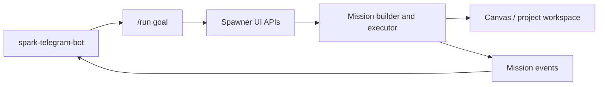

# Spawner UI

Spawner UI is the execution plane and local dashboard for the Spark stack.

In the current supported starter architecture:

- `spark-telegram-bot` owns Telegram ingress
- `spark-intelligence-builder` is the Spark runtime core
- `spawner-ui` runs mission execution and the local visual control surface

Spawner UI does not own the Telegram bot token and does not receive Telegram
webhooks directly.

## Where It Fits



## What It Does

- provides the mission-building and mission-control UI
- exposes the local APIs used by the Telegram gateway for `/run`, `/board`, and
  `/mission`
- runs multi-step execution flows behind the gateway and Builder
- receives mission lifecycle callbacks from Spawner to Telegram through the
  local relay URL configured by Spark CLI
- loads PRD/project plans into the visual canvas
- coordinates configured LLM/provider runtimes through the mission orchestration layer

## Current Role In The Spark Stack

```text
Telegram
  -> spark-telegram-bot
  -> spark-intelligence-builder
  -> spawner-ui when execution is needed
```

Spawner UI is the execution backend in that shape, not a competing ingress
surface.

Spark CLI starter setup writes:

- `MISSION_CONTROL_WEBHOOK_URLS` pointing at the Telegram relay
- `TELEGRAM_RELAY_SECRET` shared with `spark-telegram-bot`
- non-secret LLM provider metadata such as provider, model, and base URL

Do not put Telegram bot tokens or cloud LLM API keys in Spawner UI env unless a
specific provider integration explicitly requires them.

## First Run

Most users should let Spark CLI install and wire this module:

```bash
spark setup
spark start spawner-ui
spark status
```

Manual local development:

```bash
git clone https://github.com/vibeforge1111/vibeship-spawner-ui
cd vibeship-spawner-ui
npm install
npm run dev
```

Then open the local URL printed by Vite.

## Agent Operating Guide

If you are an LLM agent reading this repo:

1. Use the APIs below only from a local trusted environment unless explicitly deploying.
2. Keep `TELEGRAM_RELAY_SECRET` secret; it authenticates callbacks to Telegram.
3. Do not add Telegram bot token handling here.
4. Prefer `npm run test:run`, `npm run check`, and `npm run build` before claiming the UI is ready.
5. Use the canvas/PRD bridge for project setup instead of inventing a second mission format.

Key local API surfaces:

- `/api/spark/run` - start a mission from a goal.
- `/api/mission-control/status` - mission status.
- `/api/mission-control/command` - pause/resume/kill/status.
- `/api/mission-control/board` - board summary.
- `/api/mission-control/trace` - stitched mission state across Telegram, PRD, Canvas, Dispatch, Kanban, and providers.
- `/memory-quality` - Spark memory recall quality dashboard; see
  [docs/memory-quality-dashboard.md](docs/memory-quality-dashboard.md).
- `/voice-system` - redacted Spark voice runtime dashboard. Spawner UI reads the latest Builder snapshot plus live voice profile and delivery proof, so Telegram only needs `/voice dashboard` when the operator wants to refresh broader setup context. Spawner UI does not own voice credentials, Telegram tokens, or provider selection.
- `/api/prd-bridge/write` - write a PRD into the workspace.
- `/api/prd-bridge/load-to-canvas` - load a PRD/project into the visual canvas.
- `/api/spark-agent/*` - Spark agent session bridge for canvas, mission, MCP, and event stream control.

## Local Development

1. Copy `.env.example` to `.env` for manual local development only.
2. Fill in only the provider keys and local settings you actually need, and keep secrets out of docs, command arguments, screenshots, and issue reports.
3. Start the app:

```bash
npm install
npm run dev
```

Useful scripts:

```bash
npm run build
npm run check
npm run test:run
npm run smoke:routes
npm run smoke:mission-surfaces
```

## Railway / Docker

This repo includes a Dockerfile for a hosted Spawner UI service. The production
container uses SvelteKit's Node adapter and starts with `npm start`.

For a two-service Railway deploy, keep `spark-telegram-bot` and `spawner-ui` in
the same project environment and communicate over Railway private DNS:

- `MISSION_CONTROL_WEBHOOK_URLS=http://spark-telegram-bot.railway.internal:8788/spawner-events`
- `TELEGRAM_RELAY_SECRET=<same value as the bot>`
- `SPARK_HOSTED_PRIVATE_PREVIEW=1`
- `SPARK_WORKSPACE_ID=<private non-guessable workspace slug>`
- `SPARK_BRIDGE_API_KEY=<same long value as the bot>`
- `SPARK_UI_API_KEY=<private browser/API access key>`
- `SPARK_UI_PAIRING_CODE=<optional one-time browser pairing code>`
- `SPAWNER_STATE_DIR=/data/spawner`
- `SPARK_WORKSPACE_ROOT=/data/workspaces`
- `SPARK_ALLOW_EXTERNAL_PROJECT_PATHS=0`

Mount a persistent volume at `/data` for Spawner state and workspaces. Hosted
preview links are served from the Spawner public domain and backed by files in
`SPARK_WORKSPACE_ROOT`.

Do not put `SPARK_UI_API_KEY` in browser URLs. Browser bootstrap links may use
`?workspaceId=...&pairCode=...` only when `SPARK_UI_PAIRING_CODE` is configured;
the server consumes that code once, sets an opaque session cookie, and redirects
to a clean URL.

For hosted smoke checks, run `npm run health:spark` inside the Spawner service.
Set `SPARK_HEALTH_DEEP=1` to start a tiny mission smoke. The deep smoke uses
`SPARK_HEALTH_PROVIDER` when set, then the selected Mission provider, then
`codex` as a fallback.

For the full two-service Railway setup, provider guidance, preview-link checks,
and Telegram end-to-end smoke tests, see
[docs/RAILWAY_HOSTED_RUNBOOK.md](docs/RAILWAY_HOSTED_RUNBOOK.md).

## Documentation Map

- [ARCHITECTURE.md](ARCHITECTURE.md) - current Spark execution-plane architecture.
- [SECURITY.md](SECURITY.md) - local control surface and secret-handling rules.
- [CLAUDE.md](CLAUDE.md) - instructions for coding agents working in this repo.
- [docs/MISSION_LIFECYCLE.md](docs/MISSION_LIFECYCLE.md) - canonical mission and task status vocabulary.
- [docs/SPARK_MISSION_CONTROL_TRACE.md](docs/SPARK_MISSION_CONTROL_TRACE.md) - Telegram to PRD to Canvas to Dispatch to Kanban to Trace map.
- [docs/SPARK_AGENT_BRIDGE_API.md](docs/SPARK_AGENT_BRIDGE_API.md) - Spark agent bridge API contract.
- [docs/SPARK_AGENT_CANVAS_LOCALHOST_RUNBOOK.md](docs/SPARK_AGENT_CANVAS_LOCALHOST_RUNBOOK.md) - local Spark agent canvas smoke.
- [docs/RAILWAY_HOSTED_RUNBOOK.md](docs/RAILWAY_HOSTED_RUNBOOK.md) - hosted Railway deploy, provider, and preview smoke runbook.
- [docs/archive/retired-external-bridge/README.md](docs/archive/retired-external-bridge/README.md) - retired bridge archive notes.

## Spark CLI Install Note

If you are installing the Telegram starter stack through `spark setup`, the
installer configures this module behind the gateway. You should not need to
hand-wire relay URLs, Telegram ownership, or repo-to-repo boundaries yourself.

## Security Notes

- Do not commit `.env`, provider keys, screenshots with tokens, local mission state, or private project files.
- Keep mission relay URLs on localhost for the launch stack.
- Treat browser-facing APIs as local operator surfaces unless explicitly hardened for hosting.

## License

MIT. See [LICENSE](./LICENSE).

Spark Swarm is AGPL-licensed. Other Spark repos are MIT unless their
LICENSE file says otherwise. Spark Pro hosted services, private corpuses,
brand assets, deployment secrets, and Pro drops are not included in
open-source licenses. Pro drops do not grant redistribution rights unless
a separate written license says so.
