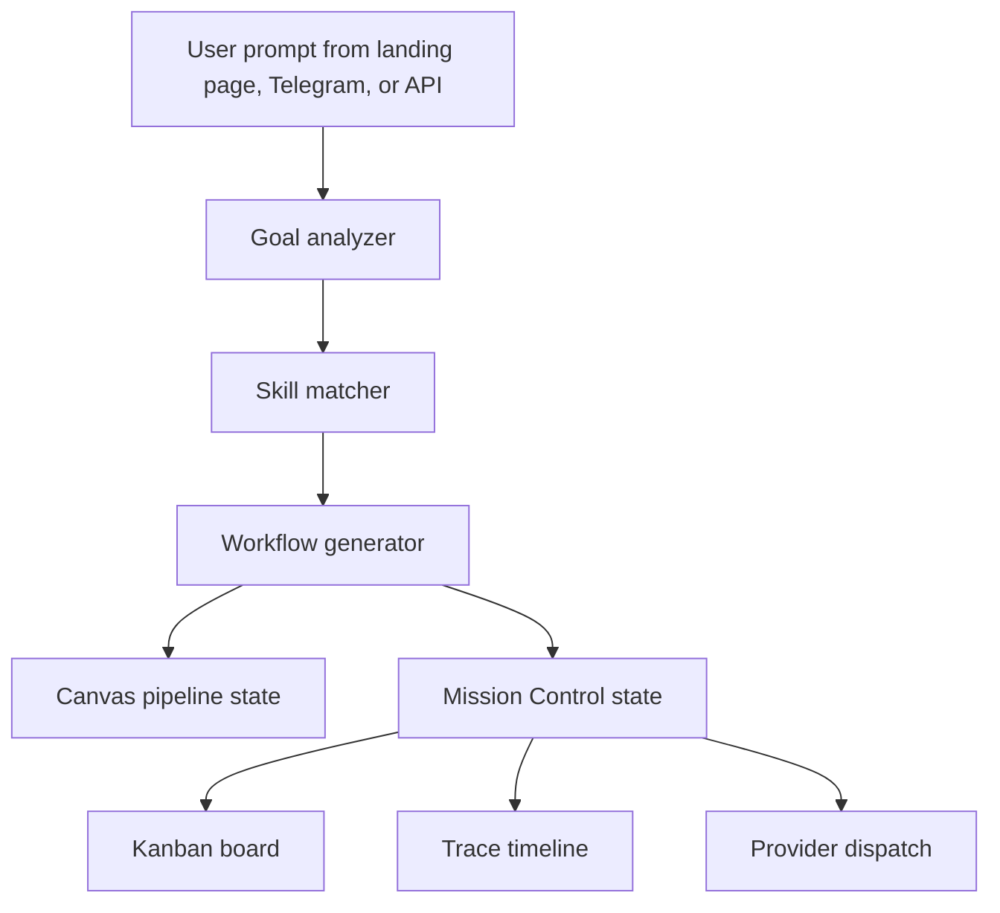

# Goal To Workflow

Spawner turns a natural-language build request into a mission workflow that can be shown on Canvas, tracked on Kanban, traced through Mission Control, and dispatched to a Spark provider.

This document describes the current local path. The older external bridge path is retired; see `docs/archive/retired-external-bridge/README.md` only if you need historical recovery notes.

## Current Flow



## Input Handling

The goal analyzer accepts short prompts, technical specs, and long PRDs. It validates length, strips unsafe markup, normalizes whitespace, and classifies the input as quick, short, paragraph, long, technical, or vague.

Vague prompts should not become a rigid questionnaire. The product direction now is:

- Ask one or two natural clarifying questions when the answer changes the build materially.
- Offer a recommended default.
- Let the user say "go" to start with the default.
- Keep build execution moving once the user confirms.

## Skill Matching

Spawner uses two skill-matching paths:

| Path | When Used | Notes |
| --- | --- | --- |
| Anthropic-assisted matching | `ANTHROPIC_API_KEY` is configured and local code requests the Claude analysis path | Sends the project description and skill index to the API, then validates the JSON response. |
| Local H70 matching | Default fallback and offline path | Uses `src/lib/services/h70-skill-matcher.ts` keyword mappings against the local skill catalog. |

The local static catalog is `static/skills.json`. At the time of this sync it contains 603 skill records. Treat that number as an observed snapshot, not a permanent contract. Verify it with:

```bash
node -e "const fs=require('fs'); console.log(JSON.parse(fs.readFileSync('static/skills.json','utf8')).length)"
```

Refresh Spawner from Spark Skill Graphs with:

```bash
npm run sync:skills
```

By default this reads the sibling `spark-skill-graphs` checkout. To use the standalone open standard artifact instead, generate a manifest in Spark and point Spawner at it:

```bash
# in spark-skill-graphs
npm run export:standard -- --out spark-skill-manifest.json

# in spawner-ui
SPAWNER_SPARK_MANIFEST=../spark-skill-graphs/spark-skill-manifest.json npm run sync:skills
```

Both `static/skills.json` and the local matcher indexes under `src/lib/data/` are rebuilt by the same command, so the dashboard, Canvas pairing, and fallback matcher stay in sync.

## Workflow Generation

The workflow generator converts matched skills into canvas nodes and connections. For mission-control builds, generated tasks become the visible unit of progress:

- `created`: the mission exists but is not dispatched.
- `planning`: PRD/canvas shaping is underway.
- `running`: at least one task/provider is active.
- `paused`: execution is intentionally stopped.
- `cancelled`: the operator stopped the mission.
- `completed`: all task terminal states are successful.
- `failed`: at least one required task/provider failed.

Canvas, Kanban, and Trace should all receive the same mission and task identifiers so a user can move between surfaces without losing context.

## Key Files

| File | Role |
| --- | --- |
| `src/lib/services/goal-analyzer.ts` | Validates and extracts keywords, technologies, features, and domains. |
| `src/lib/services/skill-matcher.ts` | Chooses Anthropic-assisted or local skill matching. |
| `src/lib/services/h70-skill-matcher.ts` | Local keyword-to-skill mappings. |
| `src/lib/services/goal-to-workflow.ts` | Orchestrates analyze, match, and workflow generation. |
| `src/lib/services/workflow-generator.ts` | Creates canvas nodes and inferred connections. |
| `src/lib/services/mission-builder.ts` | Builds executable mission prompts and task metadata. |
| `src/routes/api/analyze/+server.ts` | Server-side Anthropic-assisted analysis endpoint. |
| `src/routes/api/h70-skills/[skillId]/+server.ts` | Fetches skill content from the configured Spark skill graph source. |

## Verification

Use these checks when changing this path:

```bash
npm run check
npm run test:run
npm run build
npm run smoke:routes
npm run smoke:mission-surfaces
```

For behavior changes, also run a small mission through `/api/spark/run` or Telegram and verify:

- Kanban creates the item in the right column.
- Canvas loads the project-specific pipeline URL with `pipeline=` and `mission=`.
- Task nodes advance from pending to running to done/failed/cancelled.
- Trace shows the same mission id, request id, and task ids.
