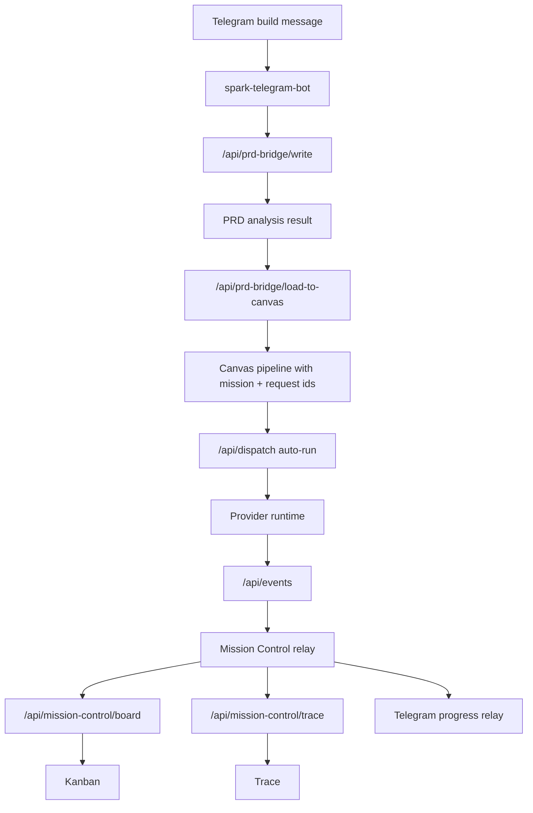

# Mission Lifecycle

Spawner UI treats a Spark build as one mission that is visible across Telegram, PRD planning, Canvas, Dispatch, Kanban, and Trace.

This document is the shared route map for future maintenance. If behavior changes, update this file and the lifecycle tests in the same change.

## Status Vocabulary

Mission board statuses live in `src/lib/types/mission-control.ts`.

| Status | Meaning | User Surface |
| --- | --- | --- |
| `created` | Mission accepted and queued, usually while PRD/canvas analysis is still happening. | Kanban To do / created |
| `running` | Dispatch or task execution is active. | Kanban In progress, Canvas execution panel |
| `paused` | Operator paused the mission. | Kanban Paused, Trace paused |
| `completed` | Mission is done and all open tasks are closed as completed. | Kanban Done, Canvas completed |
| `failed` | Mission failed or provider failure was reported. | Kanban Failed, Trace failed |
| `cancelled` | Operator cancelled the mission. | Kanban Cancelled, Trace cancelled |

Task statuses are `queued`, `running`, `completed`, `failed`, and `cancelled`.

## Runtime Flow

## Key Contracts

- Mission and request identifiers must travel together from Telegram to Canvas.
- Canvas links should include both `pipeline=` and `mission=` when available.
- Auto-run must not restart missions that are already `running`, `completed`, `failed`, or `cancelled`.
- `cancelled` is distinct from `failed`; they may both block auto-run, but they should render and trace differently.
- Terminal board statuses close open task rows so users can see completed/failed/cancelled nodes after execution.
- Trace should prefer explicit board/dispatch state over inferred artifact state.
- Completion evidence is terminal proof metadata, not success truth by itself. Failed and cancelled missions may have complete failure/cancellation proof; user surfaces must label that outcome instead of rendering it as completion proof.

## Fast Direct Completion

The constrained live fast_direct Telegram path uses `/api/prd-bridge/write` with `buildMode: direct` and
`buildLane: fast_direct`. When the brief is explicitly a static single-file or fixed-file proof, that lane is
deterministic: it writes the canonical PRD result locally, reports `autoAnalysis.provider = deterministic-fast-lane`,
and does not dispatch a provider worker. Broader fast_direct briefs may still use the configured provider path.

Completion is delivered through Mission Control relay events, not by inspecting result files later. After the canonical
result write succeeds, `relayCanonicalPrdAnalysisComplete` emits one `task_completed` event for PRD analysis and one
terminal `mission_completed` event with `requestId`, `traceRef`, `buildMode`, `buildLane`, `provider`, and
`canonicalResultAvailable: true` in the event data. The Telegram bot consumes those completion-class relay events and
turns them into the chat completion message.

The permanent guards are:

- `src/routes/api/prd-bridge/write/write.integration.test.ts` verifies the constrained fast_direct deterministic lane
  emits exactly one `task_completed` and one `mission_completed` event for the mission.
- `scripts/smoke-fastdirect-completion.mjs` verifies a running local Spawner writes the fast_direct result, exposes the
  completion event in `/api/mission-control/status`, and reports `phase = completed` from
  `/api/mission-control/trace`.

## Guard Tests

- `src/routes/api/mission-control/mission-lifecycle.integration.test.ts`
- `src/lib/server/mission-control-relay.test.ts`
- `src/lib/server/mission-control-trace.test.ts`
- `src/routes/api/dispatch/dispatch.autorun.test.ts`
- `src/routes/api/prd-bridge/write/write.integration.test.ts`
- `src/lib/types/mission-control.test.ts`

## Maintenance Rules

- Add new mission or task statuses only in `src/lib/types/mission-control.ts`.
- Do not duplicate status unions inside components or route handlers.
- If a route returns mission state, prefer the shared board/trace types or a documented adapter.
- If Telegram wording changes, keep machine-readable state unchanged and update natural-language formatting separately.
