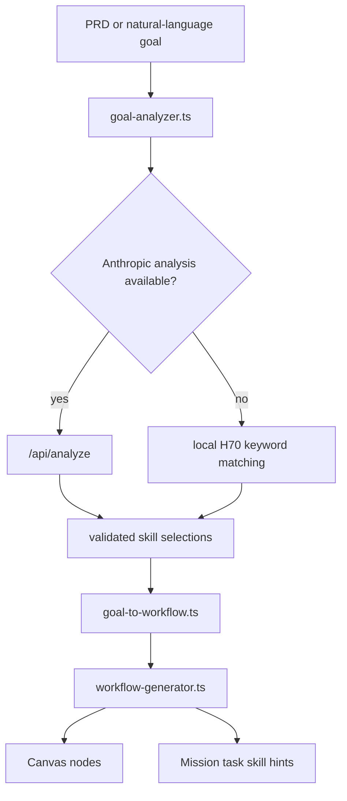

# PRD Skill Matching

Spawner uses PRD skill matching to turn a project description into task skills and execution hints. The output is used by Canvas, Mission Control, provider prompts, and task progress displays.

## Matching Modes

| Mode | Source | Behavior |
| --- | --- | --- |
| Local H70 matching | `src/lib/services/h70-skill-matcher.ts` plus `static/skills.json` | Fast, offline-friendly, deterministic enough for smoke tests. |
| Anthropic-assisted matching | `src/routes/api/analyze/+server.ts` and `src/lib/services/claude-api.ts` | Uses `ANTHROPIC_API_KEY` to select skills from the current catalog, then validates the response with Zod. |

The local catalog currently has 603 skill metadata records in `static/skills.json`. Do not hard-code this number in product logic; it is a snapshot from this documentation pass.

## Data Flow



## Local Matching

Local matching reads keywords, detected features, and detected technologies from the analyzed goal. It scores skill ids from `KEYWORD_TO_SKILLS`, then resolves them against the loaded skill store.

The local path is the expected fallback when:

- No `ANTHROPIC_API_KEY` is configured.
- The provider API is down.
- The response cannot be parsed or fails schema validation.
- Tests need deterministic behavior.

## Anthropic-Assisted Matching

The assisted path sends the project description and a domain-organized skill index to the Anthropic Messages API. The endpoint expects strict JSON with:

- technologies
- features
- domains
- suggested skills
- complexity
- summary
- optional workflow order
- optional questions

The endpoint must return `fallback: true` rather than break the product if the API key is missing or the upstream response is invalid.

## User Experience Rules

Skill matching is a build aid, not a chat obstacle.

- Ask fewer, better questions.
- Recommend a default when the user is unsure.
- Let "go" dispatch the recommended default.
- Keep task names readable in Telegram, Canvas, and Kanban.
- Use task skills as execution guidance, not as separate user-facing chores.

## Key Files

| File | Purpose |
| --- | --- |
| `src/lib/services/goal-analyzer.ts` | Extracts keywords, technologies, features, domains, and confidence. |
| `src/lib/services/skill-matcher.ts` | Chooses assisted or local matching and returns `MatchedSkill[]`. |
| `src/lib/services/h70-skill-matcher.ts` | Local keyword mappings. |
| `src/lib/services/goal-to-workflow.ts` | Runs the full analyze-match-generate pipeline. |
| `src/lib/services/workflow-generator.ts` | Builds canvas nodes and connections. |
| `src/lib/types/goal.ts` | Shared types and validation constants. |
| `src/routes/api/analyze/+server.ts` | Server-side Anthropic analysis endpoint. |
| `static/skills.json` | Static skill metadata catalog. |

## Troubleshooting

If a game PRD gets unrelated business skills, inspect:

- Whether the goal analyzer detected `game` as a domain.
- Whether `KEYWORD_TO_SKILLS` maps the relevant terms.
- Whether the suggested skill ids exist in `static/skills.json`.
- Whether an assisted response overrode a better local match.

If a workflow has no skills:

- Confirm `static/skills.json` is present and valid JSON.
- Confirm `loadSkillsStatic()` can load the catalog.
- Run the local matcher with `preferLocal: true`.
- Check `/api/h70-skills/<skill-id>` for missing configured skill graph roots.

## Verification

Run the standard gates:

```bash
npm run check
npm run test:run
npm run build
```

For route behavior, add:

```bash
npm run smoke:routes
npm run smoke:mission-surfaces
```

For a catalog count sanity check:

```bash
node -e "const fs=require('fs'); const skills=JSON.parse(fs.readFileSync('static/skills.json','utf8')); console.log(skills.length)"
```
