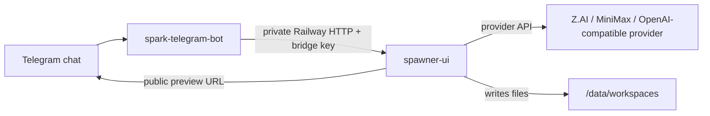

# Railway Hosted Spark Runbook

This runbook covers the self-hosted Railway shape for the Spark starter stack:

- `spark-telegram-bot` receives Telegram messages and sends `/run` missions.
- `spawner-ui` plans, executes, records, and serves hosted previews.
- Both services live in the same Railway project and talk over Railway private DNS.
- Users keep their own bot, providers, workspaces, and generated files in their own Railway account.

## Recommended Topology



Use this path when the operator wants 24/7 cloud chat and hosted static previews without running Spark locally. Local models and local CLI providers are better for desktop installs, not Railway.

## Spawner UI Variables

Set these on the `spawner-ui` service:

```text
HOST=0.0.0.0
PORT=3000
SPARK_LIVE_CONTAINER=1
SPAWNER_STATE_DIR=/data/spawner
SPARK_WORKSPACE_ROOT=/data/workspaces
SPARK_ALLOW_EXTERNAL_PROJECT_PATHS=0
MISSION_CONTROL_WEBHOOK_URLS=http://spark-telegram-bot.railway.internal:8788/spawner-events
TELEGRAM_RELAY_SECRET=<same long secret as the bot>
SPARK_BRIDGE_API_KEY=<same long bridge key as the bot>
SPARK_UI_API_KEY=<private browser/API access key>
DEFAULT_MISSION_PROVIDER=zai
```

Add provider keys only for providers you want to run in hosted mode:

```text
ZAI_API_KEY=<z.ai key>
ZAI_BASE_URL=https://api.z.ai/api/coding/paas/v4/
ZAI_MODEL=glm-5.1
MINIMAX_API_KEY=<minimax key>
MINIMAX_BASE_URL=https://api.minimax.io/v1
MINIMAX_MODEL=MiniMax-M2.7
```

Mount a Railway volume at `/data`. The service stores Mission Control state under `/data/spawner` and generated preview workspaces under `/data/workspaces`.

## Bot Variables

Set these on the `spark-telegram-bot` service:

```text
TELEGRAM_RELAY_PORT=8788
TELEGRAM_RELAY_URL=http://spark-telegram-bot.railway.internal:8788/spawner-events
TELEGRAM_RELAY_SECRET=<same long secret as Spawner>
SPAWNER_UI_PUBLIC_URL=https://<spawner-public-domain>
SPAWNER_UI_URL=http://spawner-ui.railway.internal:3000
SPARK_BRIDGE_API_KEY=<same long bridge key as Spawner>
SPARK_UI_API_KEY=<same UI key Spawner expects for protected UI/API reads>
```

Use `SPAWNER_UI_PUBLIC_URL` for links sent to Telegram. Use the private `SPAWNER_UI_URL` for service-to-service calls.

## Provider Guidance

Hosted Railway builds should prefer API providers:

- Z.AI GLM: good default for hosted static-site smoke tests.
- MiniMax: good second API smoke once the key is valid.
- OpenAI-compatible providers: good when the endpoint can return normal chat completions.

Avoid local-only provider paths in Railway:

- Codex CLI OAuth and Claude CLI sessions are desktop/operator-machine flows, not ideal container credentials.
- Ollama and LM Studio are local model servers. They are not useful inside Railway unless you separately host model infrastructure with enough GPU/CPU capacity.

If `MiniMax API error 401 invalid api key` appears, the Spawner path is reaching MiniMax but the Railway `MINIMAX_API_KEY` must be refreshed.

## Smoke Tests

First verify the service is alive:

```bash
curl https://<spawner-public-domain>/api/health/live
```

Then verify protected provider metadata with the UI key:

```bash
curl -H "x-spawner-ui-key: $SPARK_UI_API_KEY" \
  https://<spawner-public-domain>/api/providers
```

A direct hosted build smoke should end with:

- Mission status: `completed`
- Provider result has `project_path`
- Provider result has `preview_url`
- Preview URL returns `200 text/html`

Telegram end-to-end smoke:

```text
/run Build a tiny static landing page for a plant shop. Use plain HTML, CSS, and JavaScript. No build step. Include a hero, product categories, opening hours, location, and one interactive category filter.
```

Expected Telegram outcome:

```text
Spark shipped it.

Open it here:
https://<spawner-public-domain>/preview/<token>/index.html
```

## Known Failure Meanings

- `Spawner UI (:3000): HTTP 401`: the bot is using the wrong Spawner UI key, or the health check is pointed at a protected route.
- `provider_auth` or provider `401`: the chosen provider key is invalid or expired.
- Mission completes but no link appears: check Mission Control board provider results for `project_path` and `preview_url`.
- Preview link returns `403 Project previews are local-only by default`: hosted preview domain is not allowed by the Spawner preview host guard.
- Preview link returns `404`: files were not written to the project workspace, or the preview token points at the wrong workspace root.

## Security Notes

- Do not put the Telegram bot token in Spawner.
- Keep `SPARK_BRIDGE_API_KEY`, `SPARK_UI_API_KEY`, provider keys, and `TELEGRAM_RELAY_SECRET` in Railway variables only.
- Keep `SPARK_ALLOW_EXTERNAL_PROJECT_PATHS=0` for hosted services.
- Use private Railway domains for bot-to-Spawner calls.
- Public preview links expose generated static output. Do not include secrets, private logs, private repos, memory exports, or tokens in generated projects.
