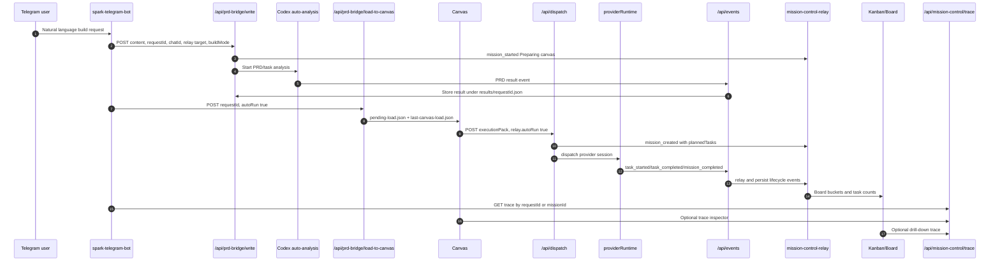
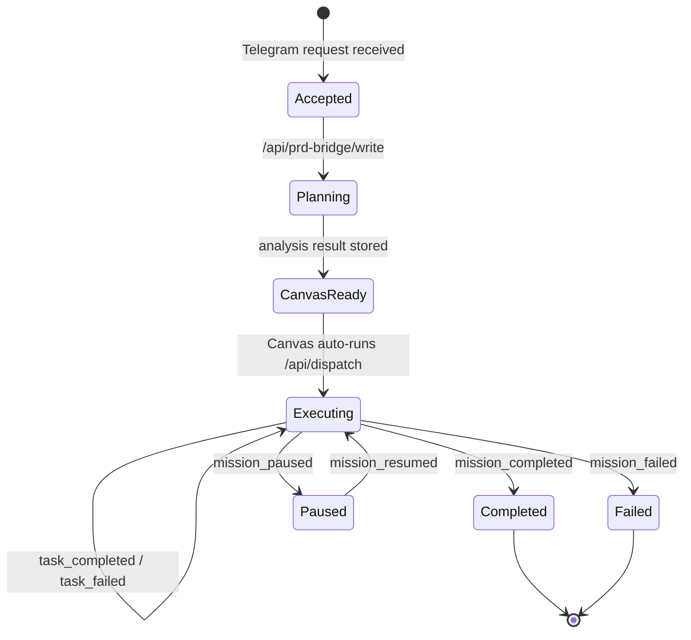
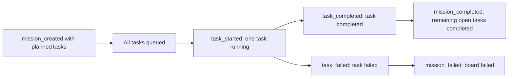

# Spark Mission Control Trace

This document is the reference map for Telegram-driven Spark builds inside Spawner UI. It explains how a natural-language request becomes a PRD/task graph, how Canvas starts execution, how providers report progress, and how Telegram, Canvas, and Kanban should all read the same mission state.

The guiding rule: Mission Control events are the shared operational spine. Telegram should not infer progress from chat text, Canvas should not invent mission completion locally, and Kanban should not guess task state from provider summaries. They should all consult the same traceable mission data.

## Primary Flow



## Route Map

| Route | Owner | Purpose | Reads | Writes |
| --- | --- | --- | --- | --- |
| `POST /api/prd-bridge/write` | Telegram/build ingress | Accepts the raw user request, records request metadata, starts auto-analysis | request body | `pending-prd.md`, `pending-request.json`, `prd-auto-trace.jsonl` |
| `GET /api/prd-bridge/result?requestId=...` | Telegram polling | Checks whether PRD/task analysis exists | `results/<requestId>.json` | none |
| `POST /api/prd-bridge/load-to-canvas` | Telegram/build bridge | Converts analysis result into Canvas pipeline data | `results/<requestId>.json`, `pending-request.json` | `pending-load.json`, `last-canvas-load.json` |
| `GET /api/pipeline-loader` | Canvas | Consumes pending Canvas pipeline loads | `pending-load.json` | clears pending load |
| `POST /api/dispatch` | Canvas execution | Starts provider runtime from the execution pack | execution pack, env provider config | Mission Control events, provider runtime session state |
| `GET /api/dispatch?missionId=...` | Canvas/trace | Provider execution status | provider runtime snapshots/results | none |
| `POST /api/events` | Providers/Codex/Claude/ZAI bridge | Receives task and mission lifecycle events | event body, `last-canvas-load.json` for relay enrichment | Mission Control relay state, provider terminal reconciliation |
| `GET /api/mission-control/board` | Kanban | Bucketed board view | Mission Control relay state, provider results | none |
| `GET /api/mission-control/status?missionId=...` | Status/debug | Raw relay snapshot for a mission | Mission Control relay state, provider results | none |
| `GET /api/mission-control/trace?missionId=...&requestId=...` | Telegram/Canvas/Kanban tracer | One stitched answer for where a mission is right now | pending request, analysis result, last Canvas load, board, dispatch, provider results | none |

## Persistent State Files

All paths below are relative to `SPAWNER_STATE_DIR` when set, otherwise `.spawner` in the Spawner working directory.

| File | Writer | Reader | Meaning |
| --- | --- | --- | --- |
| `pending-prd.md` | `/api/prd-bridge/write` | auto-analysis worker | Raw/enriched request body to analyze |
| `pending-request.json` | `/api/prd-bridge/write` | `/api/prd-bridge/load-to-canvas`, `/api/mission-control/trace` | Request metadata, build mode, requestId, missionId, Telegram relay identity |
| `prd-auto-trace.jsonl` | PRD bridge/auto worker | humans/debug tools | Analysis worker trace rows |
| `results/<requestId>.json` | `/api/events` or PRD result endpoint | load-to-canvas, trace | PRD/task analysis result |
| `pending-load.json` | `/api/prd-bridge/load-to-canvas` | `/api/pipeline-loader` | Next Canvas pipeline to consume |
| `last-canvas-load.json` | `/api/prd-bridge/load-to-canvas` | `/api/events`, trace | Last Canvas pipeline and relay metadata for lifecycle event enrichment |
| `mission-control.json` | `mission-control-relay` | board/status/trace | Recent mission lifecycle events and relay targets |
| `mission-provider-results.json` | `providerRuntime` | board/trace | Provider result snapshots and terminal summaries |

## Mission State Machine



Kanban task counts should move like this:



## Trace Contract

`GET /api/mission-control/trace` accepts either `missionId`, `requestId`, or both.

Example:

```http
GET /api/mission-control/trace?requestId=tg-build-8319079055-1638-1777362992971
```

Response shape:

```json
{
  "ok": true,
  "missionId": "mission-1777362992971",
  "requestId": "tg-build-8319079055-1638-1777362992971",
  "phase": "executing",
  "summary": "Task started: Build the app shell",
  "progress": {
    "percent": 25,
    "taskCounts": {
      "queued": 3,
      "running": 1,
      "completed": 0,
      "failed": 0,
      "cancelled": 0,
      "total": 4
    },
    "currentTask": "Build the app shell"
  },
  "surfaces": {
    "telegram": {
      "relay": { "port": 8789, "profile": "spark-agi", "url": null },
      "chatId": "8319079055",
      "userId": "8319079055"
    },
    "canvas": {
      "pipelineId": "prd-tg-build-8319079055-1638-1777362992971",
      "pipelineName": "Spark Telegram Live Mission",
      "autoRun": true,
      "nodeCount": 6
    },
    "kanban": {
      "bucket": "running",
      "entry": {}
    },
    "dispatch": {
      "allComplete": false,
      "anyFailed": false,
      "paused": false,
      "providers": { "codex": "running" },
      "lastReason": "Dispatch started"
    }
  },
  "timeline": []
}
```

## Surface Responsibilities

### Telegram

Telegram should use the trace endpoint for user-facing updates:

- `phase=planning`: "Spark is shaping the plan and preparing the canvas."
- `phase=canvas_ready`: "Canvas is ready and set to auto-run."
- `phase=executing`: report `progress.taskCounts`, `progress.currentTask`, and provider status.
- `phase=completed`: summarize provider result and target project path when available.
- `phase=failed`: show the failed task/provider and next recovery action.

Telegram should avoid dumping raw provider JSON. Provider summaries should already be compacted by Mission Control result helpers.

### Canvas

Canvas owns visual task graph execution. It should:

- Load pipeline data from `/api/pipeline-loader`.
- Preserve `relay`, `requestId`, `missionId`, `autoRun`, `buildMode`, and `buildModeReason`.
- Auto-run only when `relay.autoRun === true` and dispatch has not already reached a terminal board state.
- Send execution packs to `/api/dispatch`.
- Optionally call `/api/mission-control/trace` for an operator panel.

### Kanban

Kanban owns board visibility. It should:

- Use `/api/mission-control/board` for bucketed cards.
- Show `taskStatusCounts` and `tasks[].status`.
- Treat `plannedTasks` from mission creation as queued tasks.
- Never downgrade terminal task states when older running events replay.
- Link each card to `/api/mission-control/trace?missionId=<id>` for details.

## Event Rules

Mission Control events should include:

| Field | Required | Notes |
| --- | --- | --- |
| `type` | yes | `mission_created`, `task_started`, `task_completed`, `mission_completed`, etc. |
| `missionId` | yes | Stable id used by Canvas, Kanban, Telegram |
| `source` | yes | `prd-bridge`, `canvas-dispatch`, `codex`, `zai`, `spark-run` |
| `taskName` | for task events | Human-readable; do not send anonymous task events |
| `data.requestId` | for Telegram builds | Lets trace connect Telegram request to mission |
| `data.telegramRelay` | for Telegram builds | `{ port, profile, url }` target, used to avoid relay spraying |
| `data.plannedTasks` | on `mission_created` | Seeds Kanban queued tasks before execution starts |

## Operational Checks

Use these checks when debugging a user report:

```powershell
Invoke-RestMethod "http://127.0.0.1:5173/api/mission-control/trace?requestId=<request-id>" | ConvertTo-Json -Depth 12
Invoke-RestMethod "http://127.0.0.1:5173/api/mission-control/board" | ConvertTo-Json -Depth 12
Invoke-RestMethod "http://127.0.0.1:5173/api/dispatch?missionId=<mission-id>" | ConvertTo-Json -Depth 8
Get-Content "$env:USERPROFILE\.spark\state\spawner-ui\prd-auto-trace.jsonl" -Tail 20
```

Healthy direct build progression:

1. `pending-request.json` exists and trace phase is `planning`.
2. `results/<requestId>.json` exists and trace phase becomes `canvas_ready`.
3. `last-canvas-load.json` has `autoRun: true`, `relay.missionId`, and `relay.requestId`.
4. Canvas opens `/canvas?pipeline=<pipelineId>`.
5. `/api/dispatch?missionId=...` shows provider `running`.
6. Kanban shows planned tasks as queued, then running/completed.
7. Provider emits `mission_completed`.
8. Trace phase is `completed`, board bucket is `completed`, dispatch `allComplete` is true.

## Known Watch Points

- PRD auto-analysis often takes longer than 55 seconds. A watchdog timeout in `prd-auto-trace.jsonl` may appear before a successful result; do not treat that alone as user-facing failure.
- Tests can print webhook stderr when local `MISSION_CONTROL_WEBHOOK_URLS` points at live relay ports. Passing assertions matter; noisy webhook stderr should be cleaned separately.
- If Canvas is open from an older mission, the execution panel must remount on pipeline change.
- If events arrive newest-first from persisted relay history, task state must be monotonic: `completed`, `failed`, and `cancelled` cannot be downgraded by older `task_started` events.
